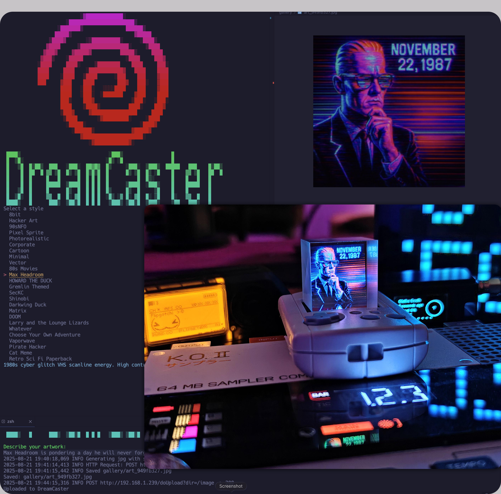

```
                           ░▓█████████████░               
                      ░███████████████████████▒           
                   ░███████▒               ██████▒        
                  █████▒                      ▓█████      
                ▒████▓       ░▒██████████░      ░████▒    
               ▓████      ▒█████████████████░     ▒████   
              ▓███▓     ▓█████▓          █████▒     ████  
             ▓███▒    ░█████               ░████     ███▓ 
            ░████     ████░     ▒████████    ████     ███░
            ████     ████    ░████████████▓   ████    ████
            ████    ░████   ▒████      ░███    ███    ▓███
            ███     ▓███    ████        ███▓   ███░   ▓███
                    ████   ░███░   ░░░░████    ███    ▓███
                    ████   ░███░  ░███████    ▓███    ████
                    ███▒    ███▓             ▒███░   ░███░
                    ████    ▒████▒          ████░    ███▓ 
                    ▒███▓     ▓████████████████     ████  
                     ▒████       ░▓█████████░     ░████   
                      ░█████░                   ░████▓    
                        ░██████▒             ▓█████▓      
                           ▓█████████████████████░        
                              ░▓████████████▓░            

 ████▒                               ░███▒                 █                 
 █  ▒█░                             ░█▒ ░█                 █                 
 █   ▒█  █▒██▒  ███   ░███░  ██▓█▓  █▒     ░███░  ▒███▒  █████   ███    █▒██▒
 █    █  ██  █ ▓▓ ▒█  █▒ ▒█  █▒█▒█  █      █▒ ▒█  █▒ ░█    █    ▓▓ ▒█   ██  █
 █    █  █     █   █      █  █ █ █  █          █  █▒░      █    █   █   █    
 █    █  █     █████  ▒████  █ █ █  █      ▒████  ░███▒    █    █████   █    
 █   ▒█  █     █      █▒  █  █ █ █  █▒     █▒  █     ▒█    █    █       █    
 █  ▒█░  █     ▓▓  █  █░ ▓█  █ █ █  ░█▒ ░▓ █░ ▓█  █░ ▒█    █░   ▓▓  █   █    
 ████▒   █      ███▒  ▒██▒█  █ █ █   ▒███▒ ▒██▒█  ▒███▒    ▒██   ███▒   █   
```                            
Simple scripts that turns a text prompt into a 240x240 JPG or GIF, saves it to a local gallery, then uploads and sets it on your fancy "hologram" device sitting around just displaying dust.

<p align="center">
  
</p>

## Features

* Style picker with simple-term-menu
* Prompt builder with your STYLE\_PROMPT\_MAP
* OpenAI image generation via Responses API with an automatic Images API fallback
* Always generates at 1024, then center crops and resizes to 240x240
* JPG gets flattened to white since JPEG has no alpha
* GIF keeps transparency and loops
* Uploads with `POST /doUpload?dir=/image` then sets with `GET /set?img=/image/filename`
* SHA256 based filenames in `gallery/`
* Logging to `dreamcaster.log`

<p align="center">
  
</p>


## Project layout

```
.
├── app
│   ├── main.py
│   ├── openai_client.py
│   └── styles.py
├── installer.sh
├── requirements.txt
├── uploader.py
└── utils.py
```

## Quick start

```bash
# 1) setup
bash installer.sh

# 2) configure
cp .env.example .env  # if not already present
# edit .env and set OPENAI_API_KEY and optional device settings

# 3) run
source .venv/bin/activate
python -m app.main
```

## Environment

Create `.env` with:

```
OPENAI_API_KEY=sk-...
OPENAI_IMAGE_MODEL=gpt-4o
DREAMCASTER_URL=http://192.168.1.239
DREAMCASTER_PATH=/image
```

## Usage flow

1. Pick a style in the terminal menu
2. Enter a short description
3. The app builds a prompt from the style guide plus your text
4. Image is generated at 1024x1024 PNG, then center cropped and resized to 240x240 RGBA
5. Choose Send to DreamCaster or Try again
6. If Send, uploader posts to `/doUpload?dir=/image` and then sets it with `/set?img=/image/filename`

## Workflow (Mermaid)


## CLI tips

* SecKC prompts you for output type
  High Art GIF or Static JPG
* Transparent backgrounds are preserved for GIF
* JPEG is flattened to white

## Device integration

* Upload endpoint
  `POST /doUpload?dir=/image`

  * JPG field name: `file`
  * GIF field name: `image`
* Set active image
  `GET /set?img=/image/<filename>`
* The uploader handles both steps in `upload_and_set`

## Troubleshooting

* Invalid value '240x240' from OpenAI
  The API only accepts 1024x1024, 1024x1536, 1536x1024, or auto. The app now generates at 1024 and resizes locally.
* No image payload found
  The extractor can handle shape changes. If Responses output does not include a findable base64 payload, the app falls back to images.generate.
* LibreSSL warning on macOS system Python
  Use Homebrew Python 3.11 or pin urllib3<2.

  ```bash
  brew install python@3.11
  python3.11 -m venv .venv
  pip install -r requirements.txt
  ```
* Module import errors
  Run from the project root:
  `python -m app.main`

## Security posture

* Secrets live in `.env` via python-dotenv. Do not commit `.env`.
* All HTTP calls are explicit, logged, and scoped to your device IP.
* Filenames are hashed to avoid collisions and PII leakage.
* No network calls except OpenAI and the device IP you set.

## Style guide

Defined in `app/styles.py`. Add your own with a single dict entry. The prompt builder will pick it up automatically.

## API notes

* Responses API with the image\_generation tool is used first
* Fallback to images.generate if extraction fails
* Output is PNG bytes. The app resizes and writes final JPG or GIF as needed

## Example session

```
$ python -m app.main
Select a style  ->  Max Headroom
Describe your artwork: 
Max Headroom is pondering a day he will never forget. November 22, 1987. 
2025-08-21 19:40:18,069 INFO Generating jpg with style Max Headroom:JPG
2025-08-21 19:41:14,413 INFO HTTP Request: POST https://api.openai.com/v1/responses "HTTP/1.1 200 OK"
2025-08-21 19:41:15,442 INFO Saved gallery/art_949fb327.jpg
Saved: gallery/art_949fb327.jpg
What next                                                                                        
> Send to DreamCaster                                                                            
  Try again                                                                                      
  Exit                                                                                           

Uploaded and set on DreamCaster
```

